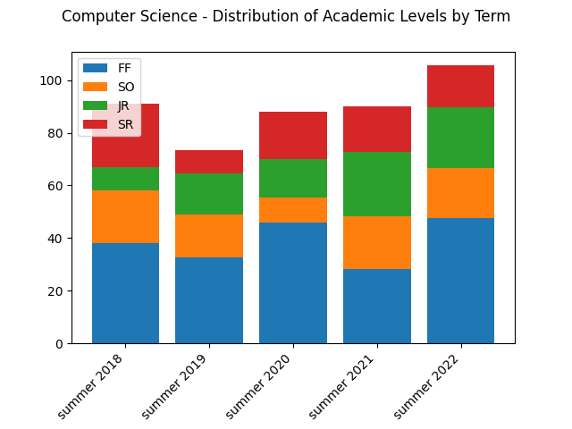

# Chair / Dean Tool Version 3

## Summary

This is a Python 3 command line tool that processes reports generated
each month currently by Mike Jonas and sent to Chairs and Deans. The
report sent to Chairs contains only select Majors and Minors. The report
sent to Deans contains all Majors and Minors within their Division. This
tool works equally well on either file format.

The purpose of the tool is to:

- provide reports containing historical context

- provide reports for a specific month

Several of the reports can produce output in both text and graph form.

The reports can be useful for:

- Identifying trends in a Major's size over time or in a specific month

- Knowing the size of each cohort within a Major over time or in a
specific month or in a specific term

- Generating email lists from a particular month optionally limited by
cohort and by GPA. For example:

  - Who were my Seniors in April 2019

  - Which current students have a GPA <= 2.0

- Identifying frequent double Majors

- Identifying

Textual reports can be emitted with headers or without and can also be
imported into Excel.

## About

The tools described herein were created by Prof. Perry Kivolowitz of
the Computer Science Department.

## The Data

Each month, a report arrives via email. The report comes in the form of
a compressed Excel spreadsheet (i.e. one with a file name ending in
".xlsx"). This file must be loaded into Excel and exported in one or
two ways.

The Excel spreadsheet always arrives with the same name and never
contains any indication of what month to which it corresponds.

At a minimum, use Excel to rename the file for export as a CSV file.

File names must follow this standard:

```text
MM-YYYY-mm.csv
```

Where:

| Symbol | Meaning |
| ------ | ------- |
| MM | This is a literal string |
| YYYY | Four digit year |
| mm | Two digit month |
| .csv | This a literal string |

Please note that if you have files from 2017 or earlier, they have not
been tested.

<div class="page"/>

A best practice for file handling is to accumulate all of your CSV
files into a single folder (directory). We suggest a folder that is
easy to navigate to via text. For example, on a Mac you can place
the CSV folder in your Documents directory if you so choose. Assuming
that you have named your folder "csv", you will refer to the folder on
the command line as "~/Documents/csv".

We further suggest saving the original Excel file in a different folder
having first been named properly.

## Installation

### (Modern) Windows

Get Python if you do not already have it. You can determine if you
already have python by opening a command prompt and typing:
`python --version`

If you see a response from python listing a version at 3 or above, you
are set and do not have to install python.

To install python:

- Open the Microsoft Store

- Click the tile indicating the Python with the latest version 3 that
is not marked as "(RC)"

- Click "Install"

- Close the Microsoft Store

You can now confirm you have python by performing the step described
above.

To install matplotlib:

- Open a command prompt

- Enter `pip install matplotlib` and hit return. A lot of output should
follow with the word "Successfully" near the bottom of the output.

To get the tool:

This is not defined yet. Contact pkivolowitz@carthage.edu.

Helpful Windows tip:

For the commands that generate pictures, the picture can be opened
directly from the command prompt by typing its name and hitting enter.

### On Macintosh

The Mac comes out of the box with python! Great! Actually not so great.

Apple thoughtfully includes python 2. This tool is written for python
3. Both python 2 and 3 are current versions and they are incompatible.

Still more amazingly, installing python 3 is not that easy. Why? Apple.

Follow the directions on this
[web page](https://macappstore.org/python3-2/).

After installing python 3, confirm its presence by entering
`python3 --version`. Note the `3`.

Assuming you have `python3`, you will also have `pip3`. Enter
`pip3 install matplotlib` in the terminal.

To get the tool:

This is not defined yet. Contact pkivolowitz@carthage.edu.

## The Command Line

### On Windows

Enter the command line by typing the Windows key along with the R key
(un-shifted). It will open in your home directory. You must navigate
to where you installed the tool. This is done with the cd command.

Suppose you installed the tool in Documents\chair_tool, you would:
`cd Documents\chair_tool`.

### On Macintosh

Enter the terminal application. This is easily done using Spotlight
Search. It will open in your home directory. You must navigate to
where you installed the tool. This is done with the cd command.

Suppose you installed the tool in Documents/chair_tool, you would:
`cd ~/Documents/chair_tool`.

## Running the Tool

### On Windows

The beginning of the command you must enter is: `python main.py`.

### On Macintosh

The beginning of the command you must enter is: `python3 main.py`.

## Specifying Required Options

The action of the tool is determined by the options specified on the
command line.

Options are indicated by words following `--`. In this next example,
the "folder" and "major" are required:

```text
python3 main.py --folder ~/Documents/csv --major "Computer Science"
```

the preceding is for the Mac. For Windows it might look like this:

```text
python main.py --folder %USERPROFILE%\Documents\csv --major "Computer Science"
```

Isn't that pleasant?

The `--folder` along with a path to your data is required. Note that if
you administer multiple programs and get separate spreadsheets for each,
segregate the files into different directories and then use the
`--folder` argument to differentiate between them.

If your Major's formal name contains a space, you must surround the
name with double quotes. So, Biology can be specified with
`--major Biology` but Data Science must be specified with
`--major "Data Science"`.

## Specifying Modifier Options

Some of the defined options modify other options.

### `start_month`

Several reports are sensitive to the `start_month` modifier. Specifying
it causes collected data to begin with the named file. If missing, the
starting month is set to the earliest file you have.

Suppose you have files going back to 2019. You can specify a report
to start with April 2019 by using: `--start_month MM-2019-04`.

### `end_month`

Several reports are sensitive to the `end_month` modifier. Specifying
it causes collected data to end with the named file. If missing, the
ending month is set to the latest file you have.

Some reports work with one month only (`--gpa` for example). You
specify the month using `--end_month`.

### `gpa_le`

This modifier works only with `--gpa` and `--email`. In all respects
`--email` is a synonym for `--gpa`. If you specify the `--gpa_le`
modifier, you follow it with a number representing the *maximum* GPA
to consider. If you leave this modifier out, then all GPAs will be
considered.

Suppose you wanted to email current Sophomores with a GPA less than or
equal to 2.5. Your command line might be:

```text
python3 main.py --folder csv --major "Computer Science" --gpa SO --gpa_le 2.5
```

### `graph`

If the report you want can also produce a graph in addition to a textual
report, specifying `--graph` switches the output to graphical.

For example `--counts` produces text. `--counts --graph` produces a
picture.

### `term`

Some reports are aware of terms in addition to months. Specifying
`--breakdown` produces the breakdown report for all months.
Specifying `--breakdown --term fall` produces the breakdown report
from all Fall terms. Note that covering several months in a term
causes some supported reports to average the results of the months
that comprise the term.

### `quiet`

For textual reports, specifying `--quiet` causes the report to
lack its headings. This might make import into Excel easier.

## Error Handling

There are two kinds of text output (in common between Windows,
Mac and Linux and many other operating systems). These are

- stdout - where normal text goes and

- stderr - where error text can go

The benefit of this is that normal and error output can be
split to go to do different destination. By default they
go to the same place.

For example:

```text
python3 main.py --folder csv --major "Computer Science" --breakdown --start_month MM-2018-01 --end_month MM-2018-12
```

produces the following for Computer Science:

```text
2018 6 was missing
2018 7 was missing
2018 11 was missing
Year Term         FF     SO     JR     SR
2018 j-term       27      8     21     19
2018 spring       28      9     20     20
2018 summer       38     20      9     24
2018 fall         33     19      9     24
```

Notice Computer Science is missing June, July and November of 2018.
These missing months are printed to `stderr`. If you need only the
normal output, you can send the error text someplace else.

On Windows, here is how you would send errors to the bit bucket

```text
python main.py --folder csv --major "Computer Science" --breakdown --start_month MM-2018-01 --end_month MM-2018-12 2> NUL
Year Term         FF     SO     JR     SR
2018 j-term       27      8     21     19
2018 spring       28      9     20     20
2018 summer       38     20      9     24
2018 fall         33     19      9     24
```

On the Mac, here is the same thing:

```text
python3 main.py --folder csv --major "Computer Science" --breakdown --start_month MM-2018-01 --end_month MM-2018-12 2> /dev/null
Year Term         FF     SO     JR     SR 
2018 j-term       27      8     21     19
2018 spring       28      9     20     20
2018 summer       38     20      9     24
2018 fall         33     19      9     24
```

## The Reports - High Level

### `--gpa` and `--email`

These are synonyms. They produce a customizable textual report containing
certain student information.

For example:

```text
python3 main.py --folder csv --major "Computer Science" --gpa SO --end_month MM-2020-01 2> /dev/null
Sophomores
ID      Last Name       First Name      Gender  GPA     Email           
NNNNNN  x               x               F       3.9     x x <xx@carthage.
MMMMMM  y               y               M       3.66    y y <yy@carthage.edu>
PPPPPP  z               z               M       2.125   z z <zz@carthage.edu>
--snip--
```

This command gets the email addresses, genders, student IDs and GPAs of
just the Sophomores in Computer Science in January 2020.

Note the format of the email addresses. These are expanded format
addresses which list both the real name and the email address of each
person.

`--graph` is not honored.

`--term` is not honored.

`--gpa_le` is honored.

Use case examples:

- Who were your majors in a certain month in the past?

- What Juniors were in GPA jeopardy?

- Which Seniors have GPAs above 3.5 and should be listed for Departmental
honors?

- Which Juniors might serve as tutors?

### `--counts`

This report breaks out counts of each cohort over the specified months.
These counts are provided for both Majors and Minors. Also emitted is
an overall percentage of Female participation within the named
department (that is, the value provided indicates a percentage which
is reflects the Major and Minor combined).

For example:

```text
python3 main.py --folder csv --major "Computer Science" --counts --start_month MM-2022-01
                  Majors                   Minors              
Year Month        FF   SO   JR   SR   TO   FF   SO   JR   SR   TO   Pct F
2022 January      29   14   21   23   87    7    3    4    5   19   20.75
2022 February     26   11   20   25   82    8    3    4    5   20   20.59
2022 March        26   11   21   25   83    9    3    4    7   23   21.70
2022 April        27   11   22   24   84    8    3    3    8   22   22.64
2022 May          26    8   20   30   84    8    2    2   10   22   22.64
2022 June         48   19   23   16  106   11    6    3    5   25   20.61
2022 July         49   19   23   16  107   17    6    3    5   31   22.30
2022 August       46   19   23   16  104   19    6    3    5   33   21.74
```

`--term` is not honored by this report.

`--graph`  produces a graph broken out over terms.

```text
python3 main.py --folder csv --major "Computer Science" --counts --graph    
2018 6 was missing
2018 7 was missing
2018 11 was missing
2019 7 was missing
Cohort Sizes by Month image saved with file name: majors_total_yoy.png
```

`--quiet` is honored by this report.

The graph looks like this:


Remember that the Fall of year N corresponds to the year N - 1.

Notice the handling of missing months such as November of 2018. Also
note the differences in the vertical axis. This is currently a known
shortcoming which can be remedied in the future.

Use case examples:

- How many Majors and Minors where there in April 2020?

- How does this year compare to previous years?

- How does graduations in May impact the Major or Minor?

- How does enrollment bump up during the Summer?

There is broad overlap with the `--breakdown` report with `--counts`
reporting month by month where `--breakdown` reports term by term.

### `--breakdown`

This report is term-aware. It will average each month in a given term
to produce a view of the size of the selected Major in that term. This
is done in part to make terms containing missing months comparable to
terms with all its months found.

```text
 python3 main.py --folder csv --major "Computer Science" --breakdown 2> /dev/null
Year Term         FF     SO     JR     SR  Total
2018 j-term       27      8     21     19     75
2018 spring       28      9     20     20     76
2018 summer       38     20      9     24     91
2018 fall         33     19      9     24     85
2019 j-term       29     15     11     25     80
2019 spring       23     14     10     28     75
2019 summer       32     16     16      9     74
2019 fall         32     18     16     10     76
2020 j-term       27     11     16     17     71
2020 spring       25     12     16     14     67
2020 summer       46      9     15     18     88
2020 fall         29     20     19     17     85
2021 j-term       24     15     21     21     81
2021 spring       17     14     22     22     76
2021 summer       28     20     24     17     90
2021 fall         32     21     22     18     93
2022 j-term       29     14     21     23     87
2022 spring       26     10     21     26     83
2022 summer       48     19     23     16    106
```

`--term` is honored by this report.

```text
python3 main.py --folder csv --major "Computer Science" --breakdown --term summer 2> /dev/null
Year Term         FF     SO     JR     SR  Total
2018 summer       38     20      9     24     91
2019 summer       32     16     16      9     74
2020 summer       46      9     15     18     88
2021 summer       28     20     24     17     90
2022 summer       48     19     23     16    106
```

`--graph` is honored by this report.

```text
python3 main.py --folder csv --major "Computer Science" --breakdown --term summer --graph 2> /dev/null
Cohorts by Term image saved with file name: cohorts_by_term.png
```

The resulting image looks like this:



This report honors `--start_month` and `--end_month`.

Use case examples:

- I need a nice graph showing trends over time.

There is broad overlap with the `--counts` report with `--counts`
reporting month by month where `--breakdown` reports term by term.

### `--Pairings` and `--pairings`

### `--Locate` and `--locate`

These are both text-only reports. They print your Majors if the
student's second Major is given by `--Locate` or if the student
is seeking the Minor given by `--locate`.

Students printed in these reports are limited to only those that
match `--major`.

`--graph` is not honored by this report.

`--term` is not honored by this report.

The report is generated from `--end_month`.

Note that some month reports lack students email addresses. If
`end_month` is one of these, student's names will be listed but
email information will be "N/A".

Use case examples:

- Do I have any Majors that are double majoring in Chemistry.

- Do I have any Majors that are minoring in Physics.

### `--reverse_Locate` and `--reverse_locate`

NOT IMPLEMENTED YET

These are text-only reports. They ignore `--major` and instead
prints any Majors (`--reverse_Locate`) or other Minors
(`--reverse_locate`) maintained by a student if the student matches
the argument given to the active option.

### Locate Reports Compared

- `--Locate Physics` will find students matching both Physics and
the value of `--major`.

- `--locate Physics` will find students minoring in the specified
subject and majoring in `--major`.

- `--reverse_Locate Physics` will print majors and minors of students
matching either Major to Physics.

- `--reverse_locate Physics` will print majors and minors of students
matching any minor to Physics.
